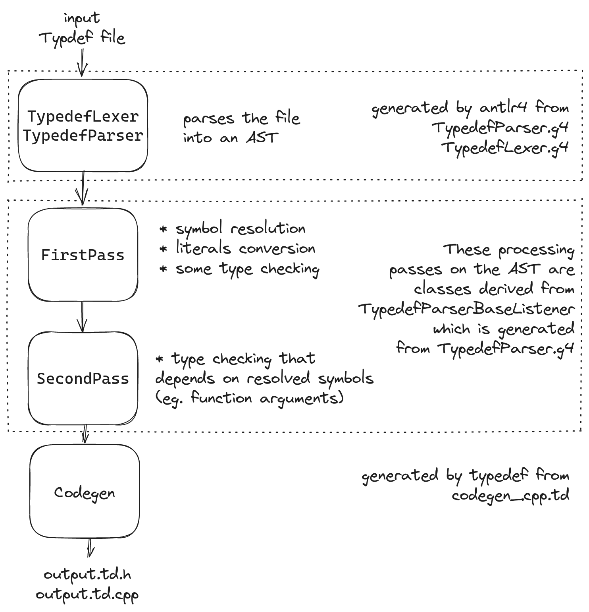

# Architecture

This document provides a high-level overview of typedef's architecture. 

 
generated with [excalidraw.com](https://excalidraw.com/) ([src](./overview.excalidraw))

## Typedef Grammar Nomenclature

 
generated with [excalidraw.com](https://excalidraw.com/) ([src](./grammar_nomenclature.excalidraw))

#### Notes

[This post](https://matklad.github.io//2021/02/06/ARCHITECTURE.md.html) is a great guide on what an architecture doc should contain.
