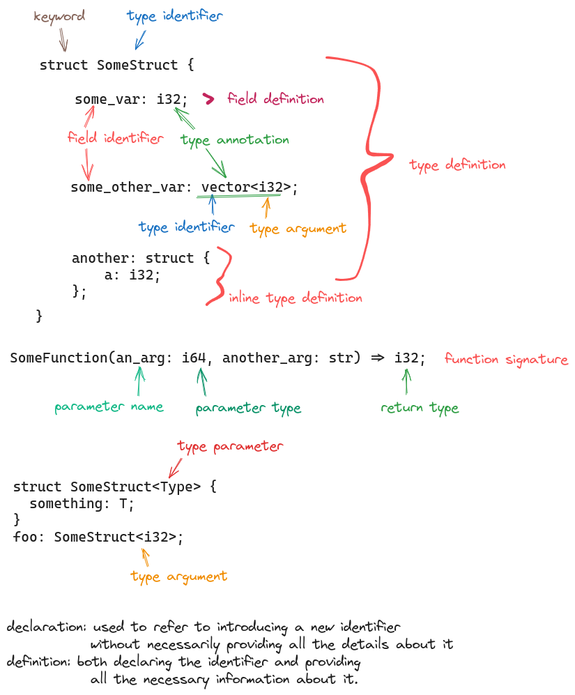

# Architecture

This document should in the future provide a high-level overview of typedef's architecture. See [this post](https://matklad.github.io//2021/02/06/ARCHITECTURE.md.html) as a guide.

## Typedef Grammar Nomenclature

 
generated with [excalidraw.com](https://excalidraw.com/) ([src](./grammar_nomenclature.excalidraw))